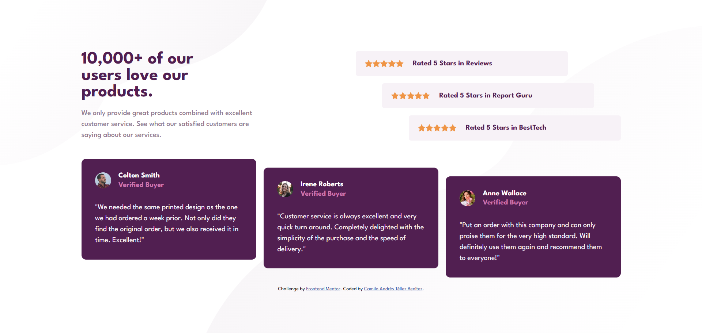

# Solución al reto "Social proof section solution"

Esta es mi solución al desafío [Social proof section solution en Frontend Mentor](https://www.frontendmentor.io/challenges/social-proof-section-6e0qTv_bA). Los desafíos de Frontend Mentor me ayudan a mejorar mis habilidades de desarrollo construyendo proyectos realistas.

## Tabla de contenidos

- [Descripción general](#descripción-general)
  - [El desafío](#el-desafío)
  - [Captura de pantalla](#captura-de-pantalla)
  - [Enlace al proyecto](#enlace-al-proyecto)
- [Mi proceso](#mi-proceso)
  - [Tecnologías utilizadas](#tecnologías-utilizadas)
- [Sobre mí](#sobre-mí)

## Descripción general

### El desafío

El objetivo principal de este proyecto fue lograr que la página tuviera un diseño óptimo en cualquier tamaño de pantalla y dispositivo, garantizando una experiencia fluida para los usuarios.

### Captura de pantalla

A continuación, muestro el resultado del proyecto en una pantalla de escritorio:

### Enlace al proyecto

- [Ver el sitio en línea](https://camilo-atb.github.io/Social-Proof-Section-/)

## Mi proceso

### Tecnologías utilizadas

Para desarrollar este proyecto, utilicé las siguientes tecnologías y herramientas:

- **HTML5 semántico** para una estructura clara y accesible.
- **CSS con propiedades personalizadas** para mantener consistencia en los estilos.
- **Flexbox** para la disposición flexible de los elementos.
- **CSS Grid** para organizar mejor el contenido de forma responsiva.
- Enfoque **mobile-first** para garantizar una óptima experiencia en dispositivos móviles.

## Sobre mí

Soy Camilo Andrés Téllez Benítez, apasionado por el desarrollo front-end y en constante aprendizaje. Puedes encontrarme en:

- [LinkedIn](http://www.linkedin.com/in/camilo-téllez)
- [Frontend Mentor](https://www.frontendmentor.io/profile/camilo-atb)
- [YouTube](https://www.youtube.com/@camilotellez887)

¡Gracias por visitar mi proyecto! 🚀
